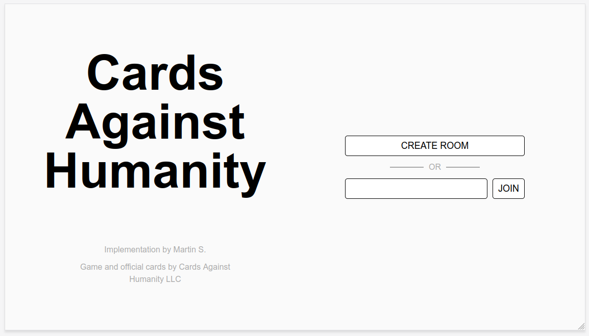
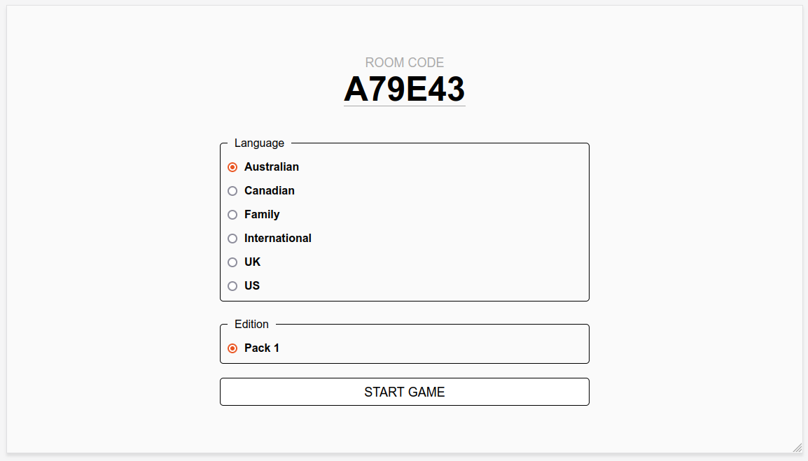
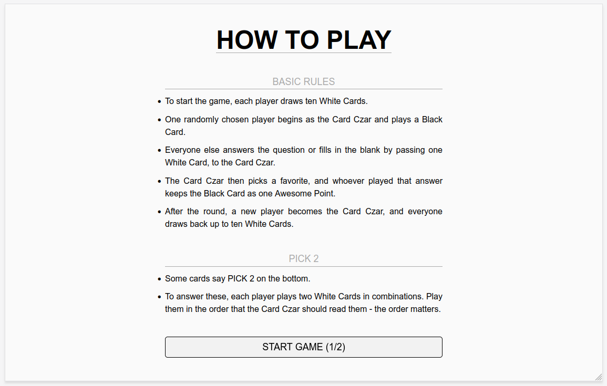
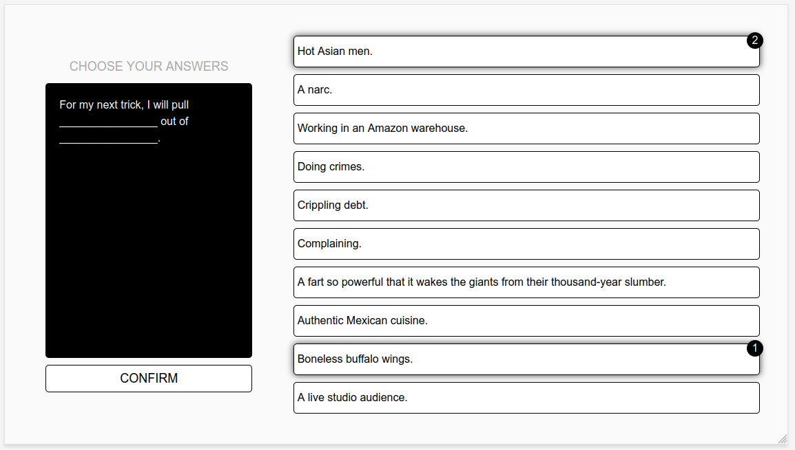
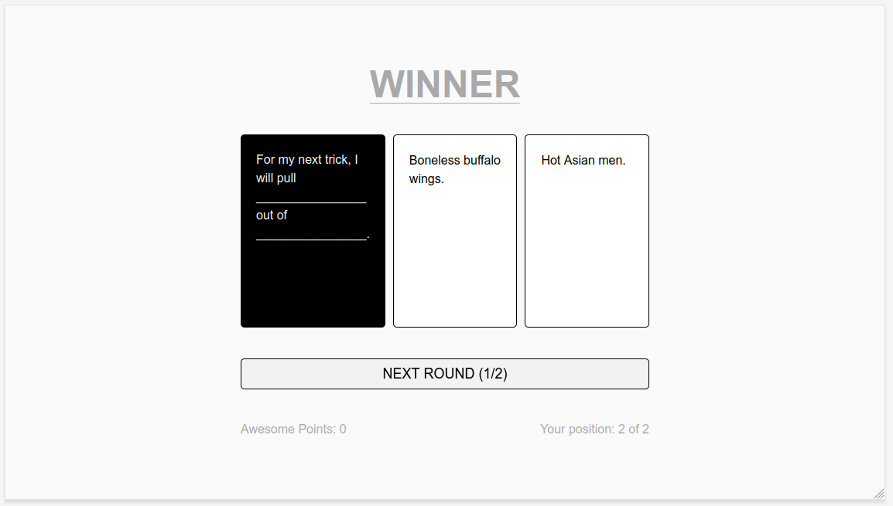

# Cards Against Humanity
WebSockets implementation of Cards Against Humanity as single page application

## Features
* Room system with code
* Settings for game host
* Tutorial
* Game with official rules
* Leaderboards
* Support for additional card packs
    * Format: `Language_edition_color`
    * Example: `English_3_white`

## TODO
* Animations
* More settings
    * Gambling
    * House Rules
* Handle client connect/disconnect mid-game
* More card packs
    * [Dutch by Hannah Mathon](https://cdn.sanity.io/files/vc07edlh/production/137a2a1e13b9e10d3d8560d971af0e74967ec523.pdf)
    * [Portuguese (BZ) by Matheus Sanches](https://cdn.sanity.io/files/vc07edlh/production/849396f7cd3faae13068827c3075e625786a7aa2.pdf)
    * [Turkish by Mertka](https://cdn.sanity.io/files/vc07edlh/production/60d725d33d4a2d0519b4df4854551be27a1e439d.pdf)
    * [Galician by Maruxa do Recho](https://cdn.sanity.io/files/vc07edlh/production/1e093000d709e2b0e596a7a4238dfe174a166041.pdf)
    * [Portuguese (PT) by Marta Mamede](https://cdn.sanity.io/files/vc07edlh/production/a18920d2e7ba4f01ac4c657fa7e1dadfb9b3a7f4.pdf)
    * [Catalan by Víctor](https://cdn.sanity.io/files/vc07edlh/production/417171df7b5571ac575579ac262279b1b6472eca.pdf)
    * [Italian by Edoardo Zanella](https://cdn.sanity.io/files/vc07edlh/production/de175aeea29dfb9c8285906dd1e0a4a379fbf747.pdf)
    * [Spanish (AR) by @fieritacatalano](https://cdn.sanity.io/files/vc07edlh/production/70031c73ca91f62d92ca7613f3e748c14ec508f1.pdf)
    * [Greek by Man0s Tavernarakis](https://cdn.sanity.io/files/vc07edlh/production/6c1e4630292b9abb6c74debcefbe3d4e4a28045c.pdf)

# Dependencies
* NodeJS
* WebSockets
* jQuery
* Tailwind

# Screenshots

# Copyright
**This is a passion project and was developed as a proof of concept for educational purposes. No revenue shall be generated. The game and English language cards are property of Cards Against Humanity LLC.**